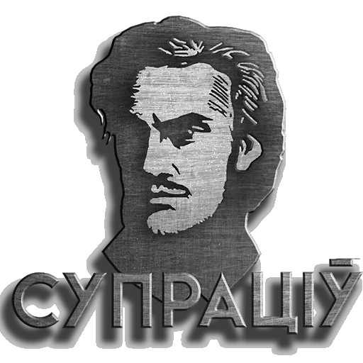
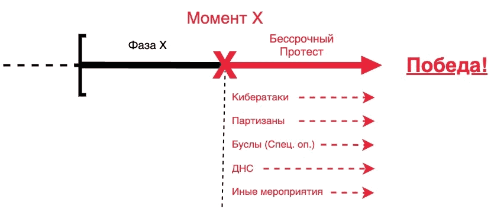
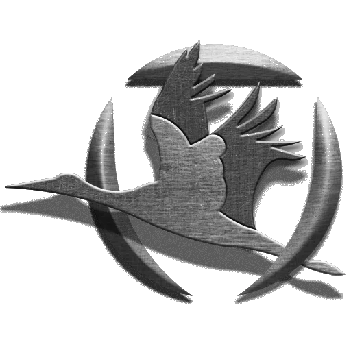
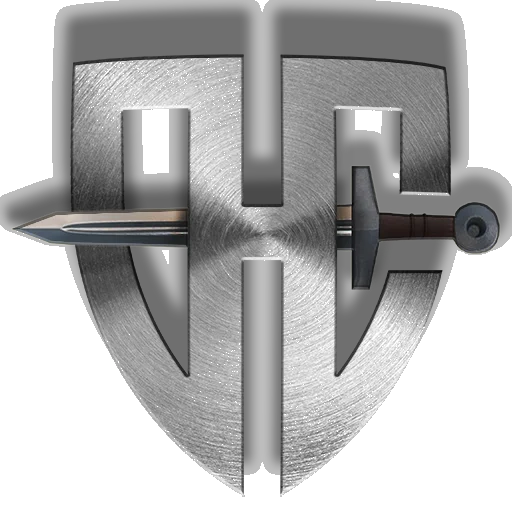
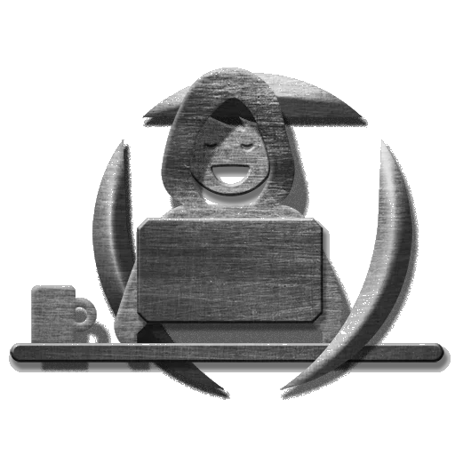

# 
Супраціў

  

  Захоўвайце спакой ды вастрыце косы

  
Наши цели:

- Сохранение независимости, суверенитета и территориальной целостности Беларуси;  
- Свержение режима Лукашенко;  
- Стабилизация РБ в переходный период, возвращение к демократическим принципам управления и законности;

  
План победы:

### Мы готовимся к Моменту Х и предлагаем наш план победы.
В этом плане есть место для каждого беларуса, от самого мирного до самого радикального.  
- **Что такое Момент Х?** - Это момент запуска множества акций, направленных на устранение фашистского режима. Это **начало бессрочного протеста** вплоть до победы. Точная дата останется **неизвестной до самого Момента Х**, который устанавливается, исходя из необходимой степени готовности партизанских организаций и всего протестного сообщества.  
- **Фаза Х** — временной отрезок, в любой точке которого может быть объявлен Момент Х. Начало Фазы Х будет объявлено заранее.
  
**Фаза Х** позволит всем в стране понять, что **мы вступили** в определенный временной **период общенациональной готовности**, и в любой момент настанет время народного выступления. **Фаза Х также введет режим в сильнейший стресс** и, в результате, его вымотает. Террористы во власти не смогут бессрочно удерживать всю систему в состоянии полной готовности. **Неизвестная по протяженности Фаза Х** переутомит режим, концентрация будет слабеть, скорость реакции снижаться. Одновременно с этим пройдет ряд спланированных нами мероприятий, которые приведут к **необратимым последствиям для режима.**

## 
Состав объединения:

  
Буслы Ляцяць

  
Диверсионные работы, изоляция либо устранение определенных лиц.

  
ДНС

  
Механизм защиты общества от карателей, считающих себя хозяевами жизни, избивая безоружных мирных граждан, в том числе пенсионеров и детей. Основная цель ДНС - защита людей на акциях гражданского неповиновения, блокировка карательных сил или их уничтожения.
Мы считаем, что общество должно прийти к осознанию, что в ответ на насилие мы должны организовать самооборону - щит, который прикроет когда понадобится, щит, в котором мы так давно нуждаемся.

  
Кибер-Партизаны

  
Кибер-атаки на сети режима, поиск информации, поддержка протестующих и обеспечение безопасности в сети.

---
## 
F.A.Q.

  
Кто мы?

Мы не кровожадные радикалы-отморозки, которыми вас пугают по телевизору.  
Мы обычные граждане, как и каждый из вас.  
Мы любим свою страну и ценим каждого человека.  
Мы простые беларусы, которых очень разозлили.  

  
Как это работает?

Создание дружин народной самообороны (ДНС), кардинально поменяет расклады в пользу протестного движения. Объясняем как это будет работать.

Возьмём к примеру потенциал протестного движения в Минске за примерную цифру в 100 тыс. человек. Безусловно, что подавляющее большинство участников, выходя на мирный протест, не могут оказывать организованное сопротивление в случае атаки карателей. На это есть ряд причин, которые невозможно изменить за короткое время. Но среди этих 100 тыс. человек присутствует около 10% людей с большим пассионарным потенциалом - это социология.  
Эти ребята периодически оказывают разрозненное сопротивление, пытаясь защитить себя и менее решительных сограждан. Мы наблюдаем такие картины с момента начала протестов. Представьте на сколько увеличится КПД подобных действий, когда удастся объединить пассионариев и они начнут работать организованно? Даже треть из них, это в количественном выражении около 3.000 человек.  
Одно дело когда каратели выезжают в приподнятом настроении на охоту на людей как на сафари, зная что они не встретят ответной реакции. И совсем другой коленкор когда в рядах протестующих находятся организованные структуры ДНС, которые могут "включить обратку". При слаженно поставленной работе ДНС по координации и защите протеста, мы с каждым разом будем повышать "цену" атак на мирные марши.  
При предлагаемом нами подходе каратели не могут предварительно идентифицировать и оценить силы ДНС. Для них каждый участник акции становиться потенциально опасным. Будет действовать эффект взаимного усиления, синергия.  
Поэтому мы акцентировали внимание на том, что работать в рамках ДНС может любой гражданин, достигший совершеннолетия. Хрупкая девушка может быть быстрым курьером, а пожилой дядечка дальнозорким разведчиком.

А теперь маштабируем протестный потенциал в рамках всей Беларуси. По данным британских социологов в тех или иных формах протестов принимало участие около миллиона человек. При должном организационном подходе, мы сможем структурировать ДНС, которые по своему потенциалу станут равны или превзойдут силы карателей. А это уже серьезная заявка на реализацию победного сценария!

  
Вы находитесь за границей?

Большинство участников и членов Совета находятся на территории РБ.  
Публичные представители по очевидным причинам ведут деятельность извне.

  
Почему вам можно доверять?

Мы уже проделали множество акций и не потеряли ни одного человека.  
Список акций: https://telegra.ph/Spisok-akcij-i-prodelannoj-raboty-dvizheniya-Supracіў-05-20

  
Какие вы даете гарантии безопасности участников?

Полной безопасности гарантировать не может никто, но риск того, что вас вычислят вне улицы снижен до нуля, при условии соблюдения вами базовых правил конспирации в сети.

Полная анонимность участников:  
- Мы не собираем никакой личной информации, кроме района проживания. Любые диверсионные акции до момента Х проводятся вне своих районов.
- Никаких списков, повязок и других отличительных атрибутов.
- Про то, что человек задействован в рамках ДНС будет знать только он и, принеобходимости, старший группы.
- Админ состав и координаторы проходят доскональную проверку. Проверка включает в себя пробив по всем нашим базам данных, личное общение, взаимодействие в течение длительного времени, успешные результаты на предыдущих позициях. В случае с членами Совета или составом старших координаторов - проверка и критерии жестче, каждый из них имеет опыт борьбы с режимом/за независимость, включая боевой опыт и подтверждение заявленной биографии от людей, с которыми мы взаимодействовали лично.
- Кибер-Партизаны отвечают за информационную безопасность ботов, и, на основе вышеуказанных фактов, мы можем поручиться за то, что утечек данных не было и не будет.  
Кибер-Партизаны создали свои боты с нуля и держат их на заграничном сервере.  
Разработка ботов ДНС и Буслов была очень хорошо продумана, и они построены по принципам анонимизации и изоляции групп для максимальной безопасности. То есть, никто из админов и координаторов ботов не имеет доступ к данным Телеграм аккаунтов участников. Бот анонимизирует пользователей.

  
Что если протестующих будут расстреливать из пулеметов и раскатывать танками по асфальту?

Почти всё то, чем пугали протестующих, в случае с переходом протеста в активную фазу, случилось и без оного: репрессии, штрафы, сутки и годы заключения, убийства, подавление волнений и укрепление власти Лукашенко.  
То, что Лука отдаст приказ можно не сомневаться, другой вопрос как он будет исполнен. 

  
Чем план ДНС отличается от Перамоги? Или это одно и тоже?

План ДНС запущен 22 марта, о создании движения "Супраціў" объявлено 14 мая.  
Список акций и проделанной работы движения "Супраціў":  
https://telegra.ph/Spisok-akcij-i-prodelannoj-raboty-dvizheniya-Suprac%D1%96%D1%9E-05-20

Ситуацинно-аналитический центр Перамога создан Тихановской и ByPol 31 мая.  
Активности участников до "нужного момента" аналитическим центром Перамога не предполагается.  
Тем не менее, мы поддерживаем с ними контакт.  

  
Как к вам присоединиться?

Нами разработан алгоритм по координации, исключающий идентификацию личности, с помощью этого алгоритма каждый сможет фунционально определиться.  
Наш ресурс: https://t.me/dns_coord_bot
 

  
А если я не готов использовать силовые методы борьбы, нужно ли мне вступать в бот?

Конечно, нам нужен каждый!  
Вы можете помочь на:  
- Информационном фронте
- Материальном снабжении
- Ненасильственном уличном противодействии
- Выведение из строя транспорта карателей (требуется навыки гонять во всю мощь!)
- Экономической борьбой

Мы самі вырашаем свой лёс

